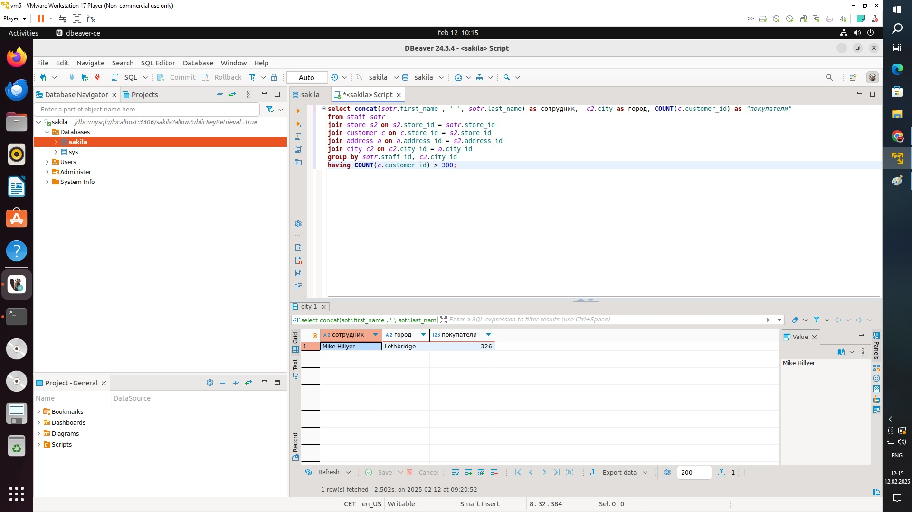
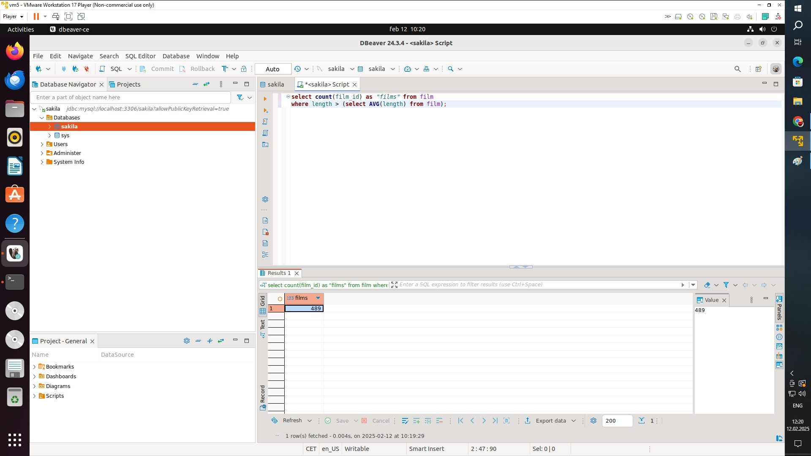
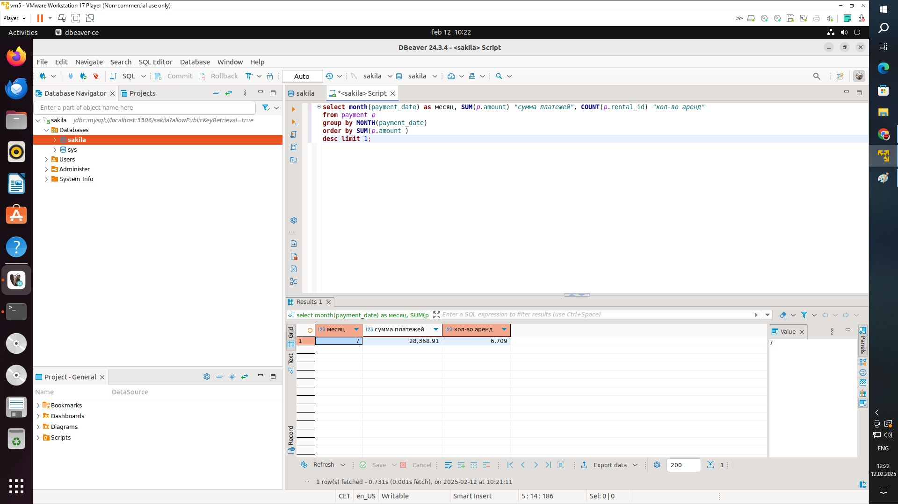

## Задание 1
Одним запросом получите информацию о магазине, в котором обслуживается более 300 покупателей, и выведите в результат следующую информацию:

фамилия и имя сотрудника из этого магазина;
город нахождения магазина;
количество пользователей, закреплённых в этом магазине.

select concat(sotr.first_name , ' ', sotr.last_name) as сотрудник,  c2.city as город, COUNT(c.customer_id) as "покупатели"
from staff sotr
join store s2 on s2.store_id = sotr.store_id 
join customer c on c.store_id = s2.store_id
join address a on a.address_id = s2.address_id 
join city c2 on c2.city_id = a.city_id 
group by sotr.staff_id, c2.city_id 
having COUNT(c.customer_id) > 300;

## Задание 2
Получите количество фильмов, продолжительность которых больше средней продолжительности всех фильмов.

select count(film_id) as "films" from film 
where length > (select AVG(length) from film);

## Задание 3
Получите информацию, за какой месяц была получена наибольшая сумма платежей, и добавьте информацию по количеству аренд за этот месяц.

Дополнительные задания (со звёздочкой*)
Эти задания дополнительные, то есть не обязательные к выполнению, и никак не повлияют на получение вами зачёта по этому домашнему заданию. Вы можете их выполнить, если хотите глубже шире разобраться в материале.

## Задание 4*
Посчитайте количество продаж, выполненных каждым продавцом. Добавьте вычисляемую колонку «Премия». Если количество продаж превышает 8000, то значение в колонке будет «Да», иначе должно быть значение «Нет».

SELECT staff_id, COUNT(rental_id) AS sales_count, CASE WHEN COUNT(rental_id) > 8000 THEN "Да" ELSE "Нет" END AS premium FROM rental GROUP BY staff_id;

## Задание 5*
Найдите фильмы, которые ни разу не брали в аренду.

SELECT f.film_id, f.title FROM film f WHERE f.film_id NOT IN ( SELECT i.film_id FROM inventory i INNER JOIN rental r ON i.inventory_id = r.inventory_id );
